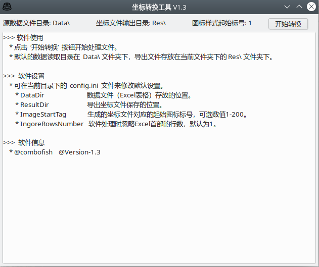

# chips-get
Shared codes edited in the learning period.

## Python3

### Python3/LocateTurn
奥维地图坐标数据转换工具，将存于Excel 表格的坐标数据文件转换成可以导入奥维地图软件的数据文件。

#### Python3/LocateTurn/V1.1
写的该工具的第一个版本，批量转换Data目录下的源数据文件，功能基本。

#### Python3/LocateTurn/V1.2
写的该工具的第二个版本，用类封装了转换的逻辑，功能基本，代码可读性强。

#### Python3/LocateTurn/V1.3-GUI-Version
写的该工具的图形界面版本（图形库用的 wxPython），功能扩展性强，有20多行的配置文件，可以做到适应多数不同内容的坐标数据文件。

#### Python3/LocateTurn/V1.4-Web-Version
写的该工具的网络版本，在V1.2的基础上实现web接口。功能基本，适应于从浏览器客户端转换单个文件使用。   
实现逻辑，Kotlin + Tomcat 实现web交互，负责上传与下载文件，上传的数据文件，由程序调用V1.2 Python代码加以转换。  

### Python3/file-script/turn.py
读取目录下所用后缀为xlsx的文件，并把该文件复制到以该文件名命名的目录下（新建），并重新命名该xlsx文件。

### Python3/DownloadImageCrawler/DownloadImageCrawler.py
网络爬虫，从当前目录下的 csv 文件中获取图片名字，逐个访问web，获取该图片的详细信息，并新建分类目录，下载该图片。
